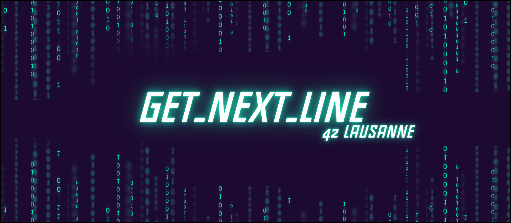

# Get_Next_Line
The **get_next_line** project is an essential step in the **42** curriculum, requiring students to reimplement the getline function from the **C** standard library. This function reads a line of text from a file character by character, **handling end-of-file (EOF) and newline (\n) characters**.

[![Contributors][contributors-shield]][contributors-url]
[![Forks][forks-shield]][forks-url]
[![Stargazers][stars-shield]][stars-url]
[![Issues][issues-shield]][issues-url]
[![LinkedIn][linkedin-shield]][linkedin-url]

## 📒 Index

- [About](#about)
- [Skills Acquired](#skills-acquired)
- [Installation](#installation)
- [Development](#development)
  - [File Structure](#file-structure)
- [Notes](#notes)
- [Credits](#credits)

## About
**get_next_line** offers the following functionalities:

**Read a line of text from an open file**: *The function reads a file line by line, storing each line in a character string*.<br>
**Handle end-of-file (EOF) and newline (NL) characters**: *The function detects the end of the file and stops accordingly. It also identifies newline characters and includes them in the read line*.<br>
**Dynamically allocate memory to store the read line**: *The function uses malloc to allocate the necessary memory for the character string that will hold the read line*.<br>
**Return the read line or a value indicating an error**: *If the reading is successful, the function returns the read line and updates the file pointer to point to the next line. If an error occurs, the function returns a negative value or NULL*.<br>

## Skills Acquired
By completing the get_next_line project, students develop the following skills:

**File and pointer manipulation**: *They learn to open, read, and close files, as well as manipulate file pointers and character pointers.*<br>
**Dynamic memory management (malloc, free)**: *They practice dynamic memory allocation and deallocation to store the read lines.*<br>
**Reading and processing individual characters**: *They learn to read and process individual characters from a file, considering special characters like NL and EOF.*<br>
**Error handling and edge cases**: *They develop techniques for handling read errors, edge cases, and error conditions.*<br>

## Installation
```bash
# Clone this repository
$ git clone https://github.com/HaruSnak/Get_Next_Line.git

# Go into the repository
$ cd Get_Next_Line

# To compile the program
$ make

# Allows you to do a complete cleaning of your construction environment
$ make fclean # Or make clean
```

## Development

### File Structure

```
.
└── 📁get_next_line
    └── get_next_line.c
    └── get_next_line.h
    └── get_next_line_bonus.c
    └── get_next_line_bonus.h
    └── get_next_line_utils.c
    └── get_next_line_utils_bonus.c
```

## Notes
<p align="left">
    
</p>

## Credits

Below you will find the links used for this project:

- [Norm 42](https://cdn.intra.42.fr/pdf/pdf/960/norme.en.pdf)
- [Nikito's explanation in video](https://www.youtube.com/watch?v=-Mt2FdJjVno)
- [Ji Woo Lee | GNL](https://velog.io/@ljiwoo59/getnextline)

[contributors-shield]: https://img.shields.io/github/contributors/HaruSnak/Get_Next_Line.svg?style=for-the-badge
[contributors-url]: https://github.com/HaruSnak/Get_Next_Line/graphs/contributors
[forks-shield]: https://img.shields.io/github/forks/HaruSnak/Get_Next_Line.svg?style=for-the-badge
[forks-url]: https://github.com/HaruSnak/Get_Next_Line/network/members
[stars-shield]: https://img.shields.io/github/stars/HaruSnak/Get_Next_Line.svg?style=for-the-badge
[stars-url]: https://github.com/HaruSnak/Get_Next_Line/stargazers
[issues-shield]: https://img.shields.io/github/issues/HaruSnak/Get_Next_Line.svg?style=for-the-badge
[issues-url]: https://github.com/HaruSnak/Get_Next_Line/issues
[linkedin-shield]: https://img.shields.io/badge/-LinkedIn-black.svg?style=for-the-badge&logo=linkedin&colorB=555
[linkedin-url]: https://www.linkedin.com/in/shany-moreno-5a863b2aa
